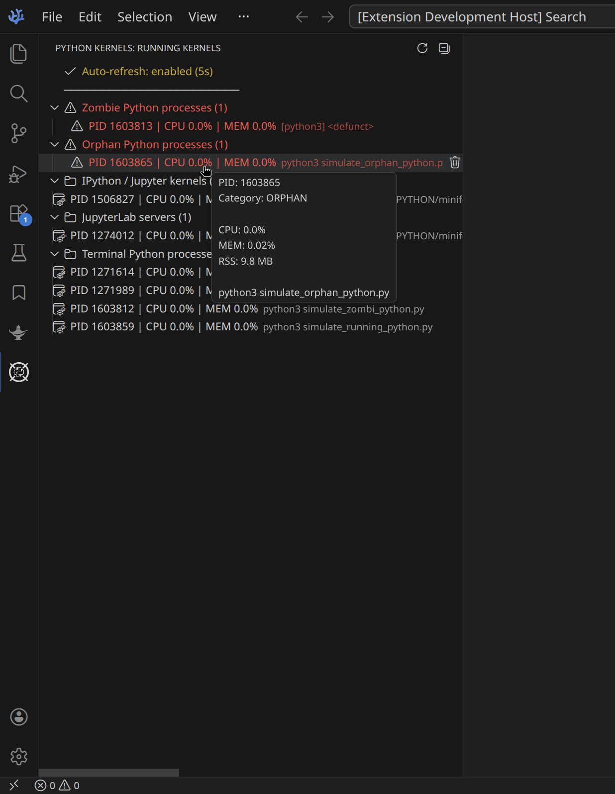
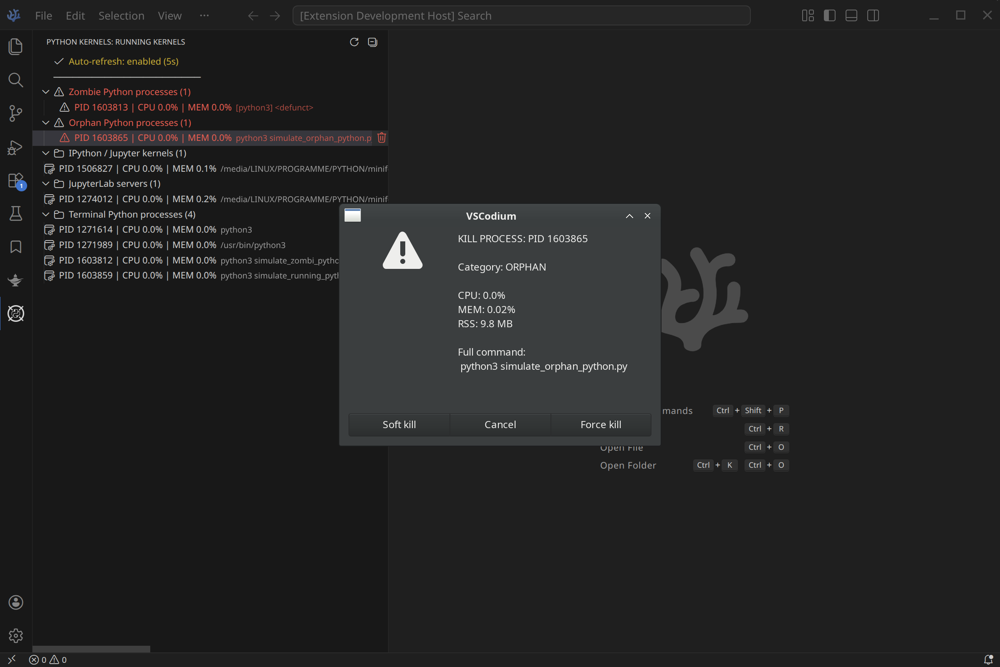

# Python Kernel Killer

Python Kernel Killer is a VS Code / VSCodium extension (Linux-focused) to inspect and manage running Python-related processes directly from the sidebar.

It is especially useful when Jupyter kernels, multiprocessing jobs, or Python scripts become unresponsive and cannot be stopped from within VS Code.

<table>
  <tr>
    <td align="center" width="48%" style="border:0;">
      <br>
      Sidebar with detected processes and tooltip information
    </td>
    &nbsp;
    <td align="center" width="48%" style="border:0;">
      <br>
      Kill process confirmation dialog
    </td>
  </tr>
</table>

---

## Features

### Process Detection

The extension detects and groups processes into:

- Zombie Python processes
- Orphan Python processes
- IPython / Jupyter kernels
- JupyterLab servers
- Terminal Python processes

Each process shows:

- PID
- CPU usage (%)
- Memory usage (% and RSS in MB)
- Full command

---

### Process Control

You can terminate processes directly from the sidebar with three modes:

- **Soft kill (SIGTERM)**

  ```bash
  kill <PID>
  ```

  Graceful shutdown (default, recommended)

- **Force kill (SIGKILL)**

  ```bash
  kill -9 <PID>
  ```

  Immediate termination (use with caution)

---

### Safety Mechanisms

To prevent accidental system damage, the extension applies multiple safeguards:

- **PID `1` is blocked**

  PID 1 (`systemd` / `init`) is the root of the process tree on Linux.  
  Terminating it can immediately destabilize or shut down the system.

- **System Python processes are protected**

  Not all Python processes are user workloads. Many desktop and system components are implemented in Python as background services in `/usr/bin` or `/usr/lib`.

  - blocked for soft kill
  - require explicit confirmation for force kill

---

### Auto Refresh

- Optional auto-refresh every 5 seconds
- Visual indicator when enabled

---

### Environment Detection

The extension extracts environment names when possible:

- Conda / Miniforge -> `envs/<name>`
- venv -> project folder name

Displayed only in the kill confirmation dialog.

---

## Security & Privacy

This extension is designed with minimal data exposure.

Instead of collecting all processes, it uses a filtered `ps` command:

```bash
ps -eo pid=,ppid=,stat=,tty=,pcpu=,rss=,comm=,args= | awk '...'
```

Filtering happens before data reaches the extension, ensuring:

- No full process list is stored
- Only relevant Python/Jupyter processes are processed

---

## Requirements

- Linux system
- Standard tools available:
  - `ps`
  - `awk`
  - `kill`

No Python packages required.

---

## Usage

1. Open the **Python Kernels** sidebar
2. Inspect running processes
3. Click a process to terminate it
4. Choose kill mode and confirm action

---

## Known Limitations

- Linux only
- Detection based on process patterns (not kernel APIs)
- Remote kernels are only visible if running locally

---

## License

MIT

---

## Release Notes

See full changelog:
👉 https://github.com/maikfussel/python-kernel-killer/blob/master/CHANGELOG.md

### [0.1.0] Latest version

- Process categorization (zombie, orphan, kernels, etc.)
- CPU and memory monitoring
- Kill modes (soft / force)
- Auto-refresh

### [0.0.1]

- Initial release